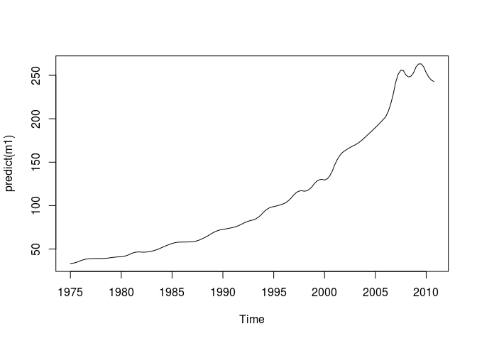
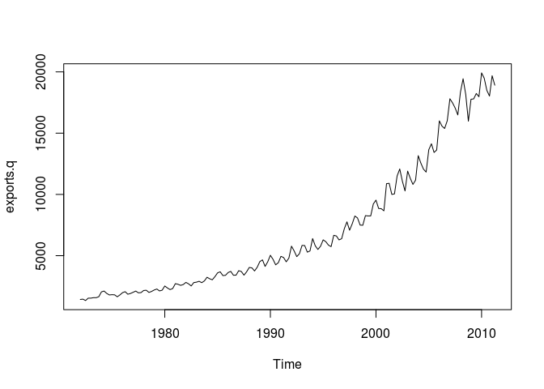
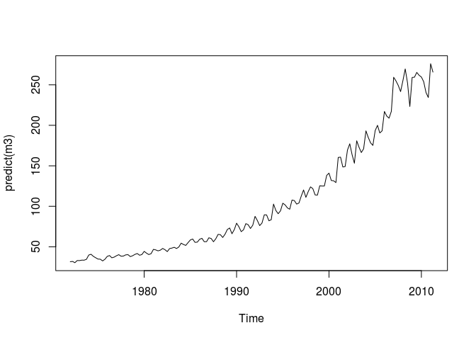
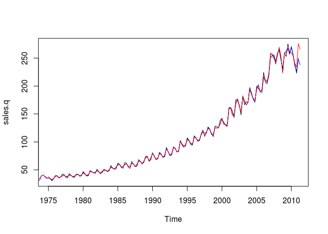

    require(tempdisagg)

    ## Loading required package: tempdisagg

Suppose we have an annual series and want to create quarterly values
that sum up to the annual values. Let us explore the annual sales of the
pharmaceutical and chemical industry in Switzerland, from which we want
to create a quarterly series.

    data(swisspharma)
    plot(sales.a)

The most simple method is without an indicator. It performs a simple
interpolation that meets the temporal additivity constraint. In R, this
can be done the following way:

    m1 <- td(sales.a ~ 1, to = "quarterly", method = "denton-cholette")

td() produces an object of class "td". The formula, 'sales.a ~ 1',
indicates that our low frequency variable will be disaggregated with a
constant. The resulting quarterly values of sales can be extracted with
the 'predict' function:

    predict(m1)

    ##           Qtr1      Qtr2      Qtr3      Qtr4
    ## 1975  33.38718  33.70254  34.33326  35.27935
    ## 1976  36.54080  37.53466  38.26095  38.71966
    ## 1977  38.91079  39.04117  39.11079  39.11966
    ## 1978  39.06777  39.14067  39.33837  39.66086
    ## 1979  40.10814  40.47720  40.76803  40.98064
    ## 1980  41.11502  41.57133  42.34956  43.44971
    ## 1981  44.87179  45.87837  46.46945  46.64503
    ## 1982  46.40512  46.37280  46.54807  46.93094
    ## 1983  47.52140  48.29746  49.25911  50.40636
    ## 1984  51.73921  53.00475  54.20300  55.33394
    ## 1985  56.39759  57.19583  57.72866  57.99608
    ## 1986  57.99809  58.03906  58.11897  58.23784
    ## 1987  58.39565  58.85255  59.60852  60.66357
    ## 1988  62.01770  63.48649  65.06993  66.76802
    ## 1989  68.58076  70.06841  71.23096  72.06842
    ## 1990  72.58078  73.11024  73.65679  74.22044
    ## 1991  74.80119  75.62961  76.70569  78.02943
    ## 1992  79.60084  80.93782  82.04037  82.90848
    ## 1993  83.54216  84.81941  86.74023  89.30463
    ## 1994  92.51260  95.06991  96.97657  98.23257
    ## 1995  98.83791  99.54488 100.35349 101.26372
    ## 1996 102.27559 103.92992 106.22671 109.16595
    ## 1997 112.74765 115.27533 116.74897 117.16859
    ## 1998 116.53417 117.04297 118.69497 121.49019
    ## 1999 125.42861 128.19226 129.78113 130.19523
    ## 2000 129.43456 130.72210 134.05785 139.44181
    ## 2001 146.87399 152.96545 157.71619 161.12623
    ## 2002 163.19556 165.10542 166.85581 168.44673
    ## 2003 169.87819 171.63042 173.70342 176.09721
    ## 2004 178.81176 181.54727 184.30371 187.08111
    ## 2005 189.87944 192.77669 195.77283 198.86789
    ## 2006 202.06184 207.98419 216.63492 228.01404
    ## 2007 242.12154 251.40903 255.87648 255.52392
    ## 2008 250.35133 248.17889 249.00662 252.83450
    ## 2009 259.66255 263.09267 263.12489 259.75919
    ## 2010 252.99558 247.92287 244.54106 242.85016

As there is no additional information on quarterly movements, the
resulting series is very smooth:

    plot(predict(m1))

While this purely mathematical approach is easy to perform and does not
need any other data series, the economic value of the resulting series
may be limited. There might be a related quarterly series that follows a
similar movement than sales. For example, we may use quarterly exports
of pharmaceutical and chemical products:

    plot(exports.q)

    m2 <- td(sales.a ~ 0 + exports.q, method = "denton-cholette")

Because we cannot use more than one indicator with the 'denton-cholette'
or 'denton' method, the intercept must be specified as missing in the
formula (0). Contrary to the first example, the 'to' argument is
redundant, because the destination frequency can be interfered from the
time series properties of 'exports.q'.

The resulting model leads to a much more interesting series:

    plot(predict(m2))

As the indicator series is longer than the annual series, there is an
extrapolation period, in which the quarterly sales are forecasted.

With an indicator, the 'denton-cholette' method simply transfers the
movement of the indicator to the resulting series. Even if in fact there
were no correlation between the two series, there would be a strong
similarity between the indicator and the resulting series.

In contrast, regression based methods transfer the movement only if the
indicator series and the resulting series are actually correlated on the
annual level. For example, a Chow-Lin regression of the same problem as
above can be performed the following way:

    m3 <- td(sales.a ~ exports.q)

As 'chow-lin-maxlog' is the default method, it does not need to be
specified. Like with the corresponding 'lm' method, summary() produces
an overview of the regression:

    summary(m3)

    ## 
    ## Call:
    ## td(formula = sales.a ~ exports.q)
    ## 
    ## Residuals:
    ##     Min      1Q  Median      3Q     Max 
    ## -77.892  -7.711  -4.628   9.647  36.448 
    ## 
    ## Coefficients:
    ##              Estimate Std. Error t value Pr(>|t|)    
    ## (Intercept) 1.241e+01  1.493e+00   8.311 1.06e-09 ***
    ## exports.q   1.339e-02  1.672e-04  80.111  < 2e-16 ***
    ## ---
    ## Signif. codes:  0 '***' 0.001 '**' 0.01 '*' 0.05 '.' 0.1 ' ' 1
    ## 
    ## 'chow-lin-maxlog' disaggregation with 'sum' conversion
    ## 36 low-freq. obs. converted to 158 high-freq. obs.
    ## Adjusted R-squared: 0.9946   AR1-Parameter:     0 (truncated)

There is indeed a strong correlation between exports and sales, as it
has been assumed in the example above. The coefficient of 'exports.q' is
highly significant, and the very high adjusted R-squared points to a
strong relationship between the two variables. The coefficients are the
result of a GLS regression between the annual series.

The estimation of the AR1 parameter, Rho, was estimated to be negative;
in order to avoid the undesirable side-effects of a negative Rho, it has
been truncated to 0. This feature can be turned off:

    td(sales.a ~ exports.q, truncated.rho = -1)

    ## 
    ## Call:
    ## td(formula = sales.a ~ exports.q, truncated.rho = -1)
    ## 
    ## Coefficients:
    ## (Intercept)    exports.q  
    ##    12.31579      0.01341  
    ## 
    ## Use summary() for details. 
    ## Use predict() to extract the final series.
    ##       
    ## Use ?td to see the help file.

Again, we can extract the resulting quarterly series of sales:

    plot(predict(m3))

Like all regression based methods, 'chow-lin-maxlog' can also be used
with more than one indicator series ('imports.q' is only significant on
a 10% level in the following example, it probably will not help to
produce a more accurate temporal disaggregation):

    m4 <- td(formula = sales.a ~ exports.q + imports.q)
    summary(m4)

    ## 
    ## Call:
    ## td(formula = sales.a ~ exports.q + imports.q)
    ## 
    ## Residuals:
    ##     Min      1Q  Median      3Q     Max 
    ## -61.648  -7.139  -2.825   5.508  53.373 
    ## 
    ## Coefficients:
    ##              Estimate Std. Error t value Pr(>|t|)    
    ## (Intercept) 11.685855   1.493077   7.827 5.08e-09 ***
    ## exports.q    0.011258   0.001158   9.723 3.26e-11 ***
    ## imports.q    0.003934   0.002113   1.862   0.0716 .  
    ## ---
    ## Signif. codes:  0 '***' 0.001 '**' 0.01 '*' 0.05 '.' 0.1 ' ' 1
    ## 
    ## 'chow-lin-maxlog' disaggregation with 'sum' conversion
    ## 36 low-freq. obs. converted to 158 high-freq. obs.
    ## Adjusted R-squared: 0.9949   AR1-Parameter:     0 (truncated)

In our example, we actually know the true data on quarterly sales, so we
can compare the artificial values to the true values:

    plot(sales.q)
    lines(predict(m2), col = "blue")        # Denton-Cholette
    lines(predict(m3), col = "red")         # Chow-Lin

With an indicator series, both the Denton method and Chow-Lin produce a
series that is close to the true series. This is, of course, due to fact
that in this example, exports are a good indicator for sales. If the
indicator is less close to the series of interest, the resulting series
will be less close to the true series.
